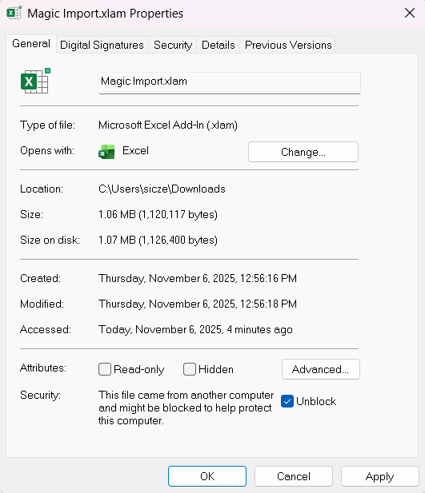
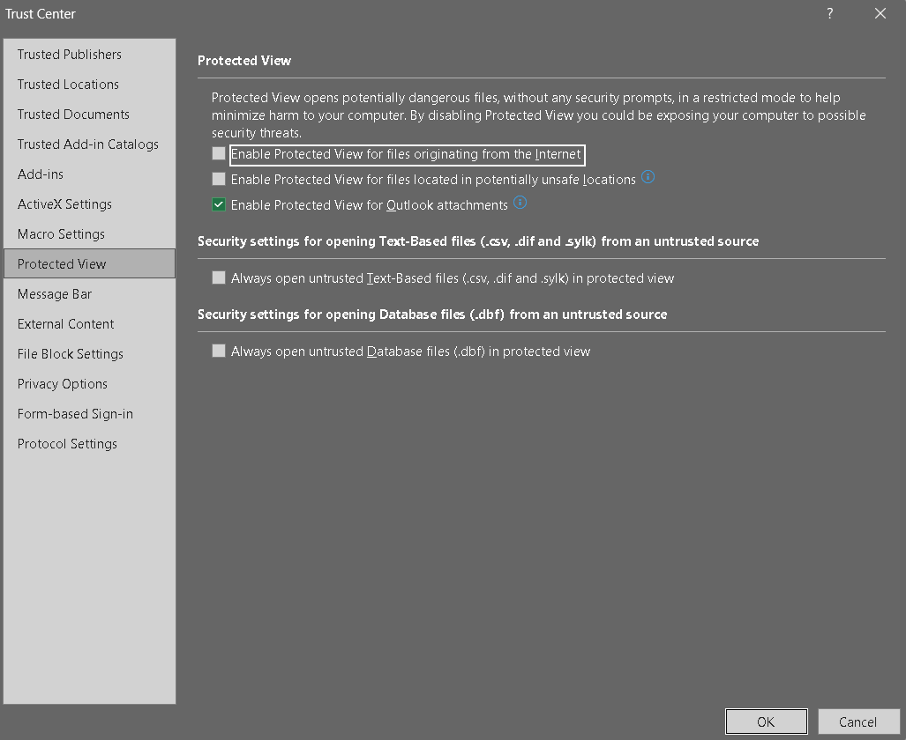
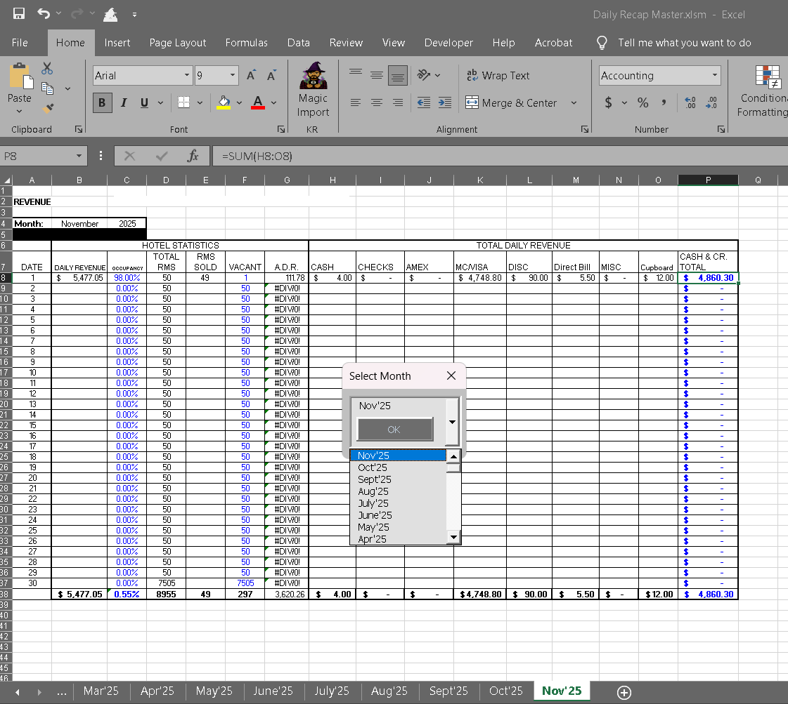

 
# MAGIC IMPORT
---
 
VBA Add-In Macro for Financial Reports excel spreadsheet. Imports manager flash and journal by transaction code reports in .xml format to spreadsheet, selects date row by parsing report name for yyyy/mm/dd, enters data according to transaction code coloumn (sums mc+vs for single column)
 
 
## Instructions
---
**Installable Add-In** 
As an Add-in (.xlam) 
 
Download .xlam from this Repository   
 
Distribute the .xlam file to users. 
 
---
 
You may have to "unblock" the .xlam add-in file by right clicking the file in file explorer, Properties > General tab > check "Unblock" 

 
Users install the add-in to Excel Spreadshet (_saved as .xlsm format_) via File > Options > Add-ins > Go... > browse > select downloaded .xlam file 
 
In "Developer" tab > "Macro Security", enable all macros & trust access to the VBA object model
 
 
**Trust adjust Center Settings:** 
In Excel, go to File > Options 
Click Trust Center (left sidebar) 
Click Trust Center Settings button 
Go to Protected View (left sidebar) 
Uncheck these options: 
"Enable Protected View for files originating from the Internet" 
"Enable Protected View for files located in potentially unsafe locations" 
  
**Add to Trusted Locations **(the download directory where th4e .xlam file is located): 
File > Options > Trust Center > Trust Center Settings 
Click Trusted Locations 
Click Add new location 
Browse to the folder containing your .xlam file 
Check "Subfolders of this location are also trusted" (if needed) 
Click OK 
 
---
 
**Naming format for Reports Scheduler** 
 
-**Manager Flash:** 
 
manager<P_FROM_DATE_YEAR><P_FROM_DATE_MONTH><P_FROM_DATE_DAY>_
 
-**Journal by Cashier & Transaction Code:**  
journal<P_FROM_DATE_YEAR><P_FROM_DATE_MONTH><P_FROM_DATE_DAY>_ 
 
(they both end with  with ".xml", so ensure the underscore_ is before the ".xml" because that will separate  
the 8 digit date text from the random generated numerical text that follows and make it more easily readable  
while still retaining the date in the correct format for the script to parse which row to insert the data.  
".xml" is auto-added to the name, outside of the custom text naming field)
**
Excel Revenue Spreadhseet Format** 

